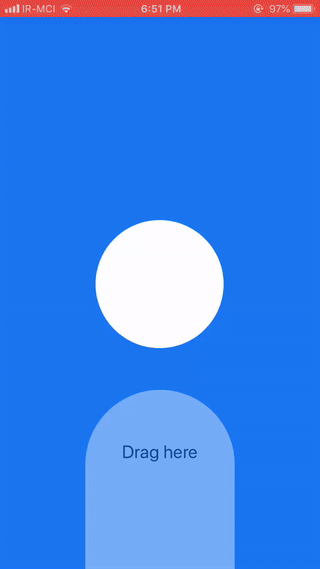

# react-native-drag-gesture-animated
This project includes some animated components using **PanResponder** functions, **Animated** and **Easing**.
# Demo :
 
- [x] Drag and drop ball (App.js)
- [x] Slider with lots of customize props (Slider.js)
### You can import Slider and set your own customize props to slider like below :
```
import Slide from './Slide';
```
```
<Slide
    slideWidth={width - 100}
    slideBorderRadius={13}
    slideHeight={193}
    slideBackgroundColor={'white'}
    wrapperHeight={220}
    wrapperWidth={width - 50}
    minNeededMove={45}
    wrapperBackgroundColor='rgba(255,255,255,.3)'
    wrapperBorderRadius={15}
/>
```
In addition you can edit default props in Slider.js.
I will handle customization of these features in the next version :
- [ ] margin between between slides
- [ ] custom animation Easing
- [ ] custom style for wrapper, box of all sliders and slider